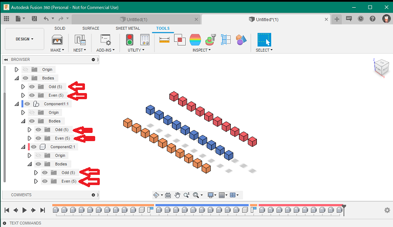

# ***Fusion360  sample CreateBodyGroup***
This is a script for Autodesk software "Fusion360".

Sample for creating a body group with the Fusion360API.


I worked on [this](https://forums.autodesk.com/t5/fusion-360-api-and-scripts/feature-request-api-for-creating-and-managing-quot-group-quot-s/td-p/9899960) one.

***
## Installation:
Please follow the instructions [here](https://knowledge.autodesk.com/support/fusion-360/troubleshooting/caas/sfdcarticles/sfdcarticles/How-to-install-an-ADD-IN-and-Script-in-Fusion-360.html).

## Usage
+ Launch the script.
    + A new document is created, several bodies are created, and a dialog is displayed.
+ Then the bodies are grouped together.
    


+ The sample itself does nothing to help. If you actually want to use it in your script/add-in, please do the following

```python
・・・
from .BodiesGroupFactry import bodiesGroupFactry

・・・

        groupFact = bodiesGroupFactry()

        groupFact.createBodiesGroup(bodiesList,'GroupName')

・・・
```

## Constraints：
- The list of bodies to be passed to the parameter is limited to bodies in the same component.
- Creating groups within a "bodies" is supported, but you can't create groups within a group.

## Action:
Confirmed in the following environment.
+ Fusion360 Ver2.0.9313
+ Windows10 64bit Pro , Home

## License:
MIT

## Acknowledgments:
+ Thank you everyone in the [Japanese forum.](https://forums.autodesk.com/t5/fusion-360-ri-ben-yu/bd-p/707)